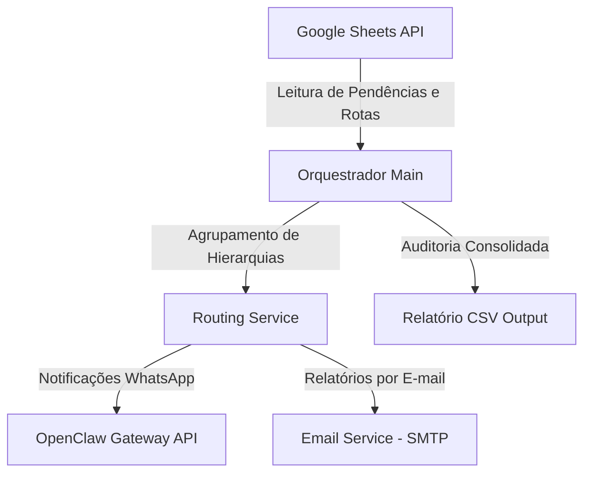

# Sistema de Automação de Cobranças por Rotas

Automação em Python para gestão e disparo de cobranças financeiras operadas via **Google Sheets**, integração de mensageria via **WhatsApp (OpenClaw API)**, relatórios por **E-mail (SMTP)** e consolidado executivo por **Rotas Operacionais**.

---

## Arquitetura do Sistema



### Funcionalidades
- **Fonte de Dados no Google Sheets**: Consumo direto das abas `Pendencias` e `Rotas` via API de Conta de Serviço (`gspread`).
- **Hierarquia Operacional por Rota**: Mapeamento automático entre Encarregado da Rota, Operador e Supervisor Regional.
- **Disparos via WhatsApp**: Envio automatizado de notificações parametrizadas (Cliente, UC, Valor, Vencimento, Código de Barras / PIX).
- **Relatórios por E-mail**: Notificações automáticas de fechamento operacional por rota e consolidação regional.
- **Modo Simulação (Dry Run)**: Validação completa da execução sem emissão de mensagens reais (`DRY_RUN=True`).
- **Auditoria de Resultados**: Exportação automática do relatório final em formato CSV no diretório `data/output/`.

---

## Estrutura das Planilhas (Google Sheets)

A planilha configurada deve conter duas abas principais com a estrutura abaixo:

### Aba `Pendencias`
| pendencia | nome_solicitante | descrição | data_máxima | telefone | anexo |
| :--- | :--- | :--- | :--- | :--- | :--- |
| PEND-101 | Maria Souza | Ajuste no medidor da quadra B | 05/08/2026 | 5585999998888 | https://site.com/foto.jpg |
| PEND-102 | João Silva | Vistoria técnica no ponto 3 | 10/08/2026 | 5585988887777 | |

### Aba `Rotas` (ou `Contatos`)
| rota | regiao | encarregado_nome | encarregado_telefone | supervisor_nome | supervisor_email |
| :--- | :--- | :--- | :--- | :--- | :--- |
| ROTA_101 | Centro | Carlos Silva | 5585911112222 | Roberto Supervisor | roberto@empresa.com |

---

## Variáveis de Ambiente

Crie o arquivo `.env` no diretório `config/` utilizando o modelo abaixo:

```env
# Modo de Execução (True = Simulação / False = Produção)
DRY_RUN=True

# Configurações do Google Sheets
GOOGLE_CREDENTIALS_FILE=config/google_credentials.json
GSHEET_SPREADSHEET_NAME=Base_Pendencias

# Integração WhatsApp (OpenClaw)
WHATSAPP_API_URL=http://localhost:8000/api/v1/send-message
WHATSAPP_API_TOKEN=seu_token_aqui

# Configurações de E-mail (SMTP)
SMTP_HOST=smtp.gmail.com
SMTP_PORT=587
SMTP_USER=seu_email@empresa.com
SMTP_PASSWORD=sua_senha_ou_app_key
EMAIL_FROM_NAME=Robô de Cobrança
```

> **Nota de Segurança**: As credenciais JSON e os arquivos `.env` estão definidos no `.gitignore` para evitar envio acidental a repositórios remotos.

---

## Execução via Docker

### 1. Docker Compose

Subir o ambiente via Docker Compose:

```bash
docker-compose up --build -d
```

Verificar os logs de execução:

```bash
docker-compose logs -f
```

---

### 2. Docker CLI

Construir a imagem da aplicação:

```bash
docker build -t cobranca-bot .
```

Executar o container mapeando os diretórios de configuração e saída:

```bash
docker run --rm \
  -v $(pwd)/config:/app/config \
  -v $(pwd)/data/output:/app/data/output \
  cobranca-bot
```

---

## Execução Local sem Docker

### Pré-requisitos
- Python 3.10 ou superior instalado.

### Passo a Passo

1. Instalar as dependências do projeto:
   ```bash
   pip install -r requirements.txt
   ```

2. Executar o robô:
   ```bash
   python main.py
   ```

---

## Licença

Projeto de desenvolvimento proprietário e de uso restrito.
